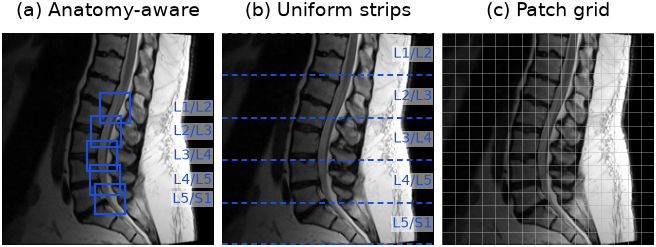
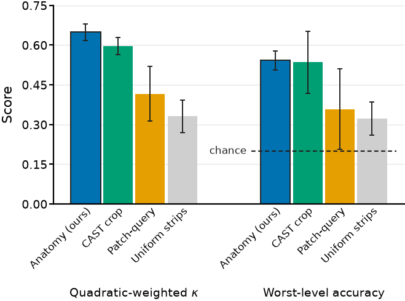
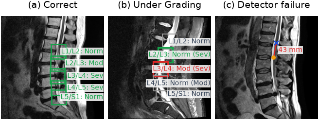

# Disentangling Imaging Plane from Slice Budget in Transformer-Based Lumbar Stenosis Grading

Target venue: IEEE ISBI 2027.

Lumbar spine MRI is interpreted one disc level at a time, and automated grading must both
assess severity and assign findings to the correct level. In this work, we study how the choice
of input affects transformer-based lumbar spine pathology grading. We vary the imaging plane and
the number of slices while keeping the backbone, encoder, and training procedure unchanged,
using a five-slice parasagittal configuration and a fixed-spacing axial configuration to
separate the plane from the slice count and from expert slice selection. We also compare
anatomy-aware tokenization with three alternatives and replace ground-truth disc locations with
a learned detector. Our experiments show that level attribution improves by 0.134 when moving
from one sagittal slice to five annotated axial slices, but slice count and expert slice
selection account for the bulk of this gain: matching the slice budget leaves only a small
residual axial advantage. Severity grading is unaffected throughout. Overall, how much the model
is shown matters more than the plane it is shown from.

## Method

A frozen DINOv2 backbone and an anatomy-aware ROI-Align tokenizer pool one token per vertebral
level, so every prediction belongs to a named level. Each level contributes one ROI token per
available view, carrying an ordinal level index and a learned view-type embedding. Backbone,
encoder, and training schedule are held fixed across every configuration below; only the input
changes.

Severity is quadratic-weighted κ. Level attribution is worst-level accuracy: whether the model
identifies the most stenotic level in a study.



The two baselines cut the same image without using disc locations: equal-height strips, or the
backbone's own patch grid queried by a learned per-level embedding.

## Results

### Tokenization



Single sagittal slice, 3 seeds (42–44), mean ± 1 sd. Anatomy-aware pooling leads on both
metrics (κ 0.649 ± 0.031, worst-level 0.542 ± 0.036); CAST crop is close on κ (0.597 ± 0.032)
but unstable in attribution, and the two location-free baselines — patch-query (0.416 ± 0.103)
and uniform strips (0.332 ± 0.061) — sit near chance for worst-level accuracy.

### Imaging plane and slice budget

Augmented runs, 5 seeds (42–46), mean ± sd. Δ is against the one-slice sagittal control.

| input | κ (severity) | worst-level acc | Δ worst-level |
|---|---|---|---|
| sagittal, 1 slice (control) | 0.618 ± 0.069 | 0.471 ± 0.057 | — |
| sagittal, 5 parasagittal slices (budget control) | 0.656 ± 0.045 | 0.576 ± 0.071 | +0.105 |
| axial, 5 fixed-spacing slices | 0.646 ± 0.074 | 0.585 ± 0.058 | +0.114 |
| axial, 5 annotated slices | 0.678 ± 0.063 | 0.654 ± 0.042 | +0.183 |
| fusion, concat | 0.697 ± 0.067 | 0.673 ± 0.036 | +0.202 |
| fusion, attention | 0.626 ± 0.055 | 0.519 ± 0.057 | +0.048 |

Severity κ never separates significantly from the control. Paired within seed, the attribution
gain splits into slice budget (+0.105, p = 0.005) and axial acquisition (+0.078, p = 0.050).
Full paired tests, that decomposition, and the fusion nulls are in
[docs/task2_writeup.md](docs/task2_writeup.md); per-run numbers are in
[results/fusion_results.csv](results/fusion_results.csv).



Level attribution is what fails first. Panel (b) is a misattribution case, selected on
`argworst(predictions) != argworst(targets)`: the severe levels are also graded down. Panel (c)
is a detector failure, L1/L2 missed by 43 mm.

## Install

Use Python 3.11 or 3.12. PyTorch has no wheels for 3.14 yet.

```
python3.12 -m venv .venv
source .venv/bin/activate
pip install -r requirements.txt
```

## Data

Not included. Download the RSNA 2024 Lumbar Spine Degenerative Classification set from

https://www.kaggle.com/competitions/rsna-2024-lumbar-spine-degenerative-classification/data

and set `RSNA_DIR` to its path.

```
python rsna_setup.py --mode subset --n 500 --out_dir $RSNA_DIR
python scripts/explore_rsna.py --data_dir $RSNA_DIR
```

## Run

Tokenizer and positional-encoding ablation (single sagittal slice):

```
python train.py --data_dir $RSNA_DIR --dataset rsna --tokenizer anatomy --pos_encoding ordinal
bash scripts/run_ablations.sh
python evaluate.py --experiments_dir outputs --data_dir $RSNA_DIR --generate_figures
```

Plane and slice-budget arms, one per row of the results table:

```
COMMON="--data_dir $RSNA_DIR --augment --seed 42"
python train_fusion.py $COMMON --views sag                              # control
python train_fusion.py $COMMON --views sag   --sag_slices 5             # budget control
python train_fusion.py $COMMON --views axial --axial_slice_selection fixed
python train_fusion.py $COMMON --views axial --axial_slice_selection annotated
python train_fusion.py $COMMON --views both  --fusion concat
python train_fusion.py $COMMON --views both  --fusion attn
```

Aggregate the tables and export per-run results:

```
python scripts/aggregate_fusion.py --experiments_dir outputs_modal --aug
python scripts/export_results.py --experiments_dir outputs_modal --out results/fusion_results.csv
python scripts/bootstrap_worst_level.py
```

## Test

These run without any data.

```
python tests/test_forward.py
python tests/test_train_loop.py
```
